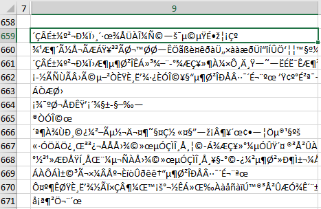

## Excel 4.0 Macro Malware

### The Phish

A user was sent a phishing email with an XLS attachment.
While the user did download the attachment, the
endpoint protection detected and quarantined it before
the user was able to open in Excel.

```email
Date: Thu, 15 Oct 2020 15:11:26 +0000 (UTC)
From: Cailyn Lam <russ8ian@aol.com>
Reply-To: Cailyn Lam <russ8ian@aol.com>
To: "username@DOMAIN.com" <username@DOMAIN.com>
Message-ID: <2197215096.990473.160274656733@mail.yahoo.com>
Subject: Contract # 2472 info

Hello
Details regarding receipt. Please verify all documentation that are attached to the
e-mail - if you will have any questions or comments, feel free to contact us.

Best Wishes,

Cailyn Lam

----------------------------------------
Attachment:
TU.2472.xls (44 KB)
SHA-256: 7a2e95ca80977a33353766d3c50a460d77edd5bfda3b1d646f58f21e28500374
```

### The Attachment

Using the endpoint protection, the XLS was acquired from quarantine.
The name of the file was `TU.2472.xls`.  The number in the file matched
the number used in the Subject line.  Perhaps something in the file
is unique for each recipient.

### Sandbox Round 1

Using Cisco Threat Grid, the XLS was run in a sandbox.  On Excel 2010 the macro engaged and prompted
the user with a dialog for OK or Cancel.  Later sandboxing with Excel 2016 the
macro was not immediately run, but the user had the opportunity to enable macros.


### Sandbox Round 2

In order to reverse engineer the scripts, a clone was made
of Windows 10 within VirtualBox.  The XLS was copied locally to the guest.
The network was disabled and shared volume removed.
At this point Windows is isolated and the macro can safely be run.

To open the XLS without the AutoExec engaging, the shift key
would be held down while opening until the file was fully opened.

### Obfuscated Scripts

A number of methods were observed to help hide the
scripts from static analysis.

Firstly the scripting functions were scattered vertically.


Secondly, some sections of the script are encoded.


