# Greatness Phishing Kit

Greatness Phishing Kit is a tool threat actors have been using since
at least August of 2022.  It aids in the creation and management
of a Microsoft credential harvesting campaign.  With it, here are some of the
actions the threat actor can perform.

1. Using several templates, the operator can:
    - Create obfuscated HTML attachments which can be emailed to victims.
    - Create obfuscated webpages to be hosted.  The URL of that webpage would be emailed to the victims.
1. Track visits, both regular and bots.
1. View collected username, passwords and cookies, including searching for them.
1. Specify a Telegram bot to receive messages for events such as successful
   collection of login and password.
1. Check if the central API is up or down.
1. Add IP addreses to a block list.
1. Upload an encoded file containing the URL to the central API.

The kit uses a central API that is likely controlled by the
purveyor of the kit.  This central API appears to sincerely perform
Microsoft authentication including handling of 2FA.
The operator of the kit is ensured that the collected
username and password is valid.  No doubt the purveyor stashes their
own copy of those credentials.  2FA appears to be provided
in the collection of cookies.

The UI presented by the kit resembles the legitimate Microsoft login
such that many folks might believe it is Microsoft, with the
obvious difference of the URL.  The majority of URLs observed
using this kit bear no resemblance to Microsoft.

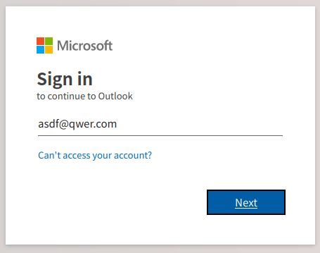

This kit was collected from a compromised machine.  At
that time the logs indicated 6,444 regular visits over the course
of three days.  In the
log of collected credentials there were 267.  That appears
to indicate a hit rate of 4%.

A single reference to this kit was found here.

https://www.wmcglobal.com/blog/2022-year-in-review#greatness-boss

## How to find malicious hosts

Use https://urlscan.io/search/ to search for one of the following.

```
page.url:"/admin/js/mj.php"
page.url:"/admin/js/fr.js"
```

## View Phishing Admin Panel

From the urlscan.io search, take any recent URL and
remove everything after the `/admin/`.

For example, a URL like this.

```
https://example.com/host26/admin/js/mj.php?ar=YWdpbmc=
```

Admin panel URL would be this.

```
https://example.com/host26/admin/
```

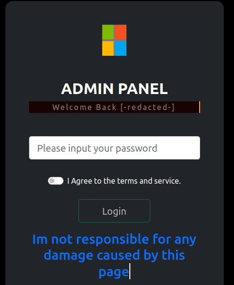

## Dashboard

Once logged in, you would see a dashboard that shows the
following information.

- Total Visits - the number of times normal users opened the phish
- Total Results - the number of credentials collected
- Total Bots - the number of times a connection was determined to be a bot

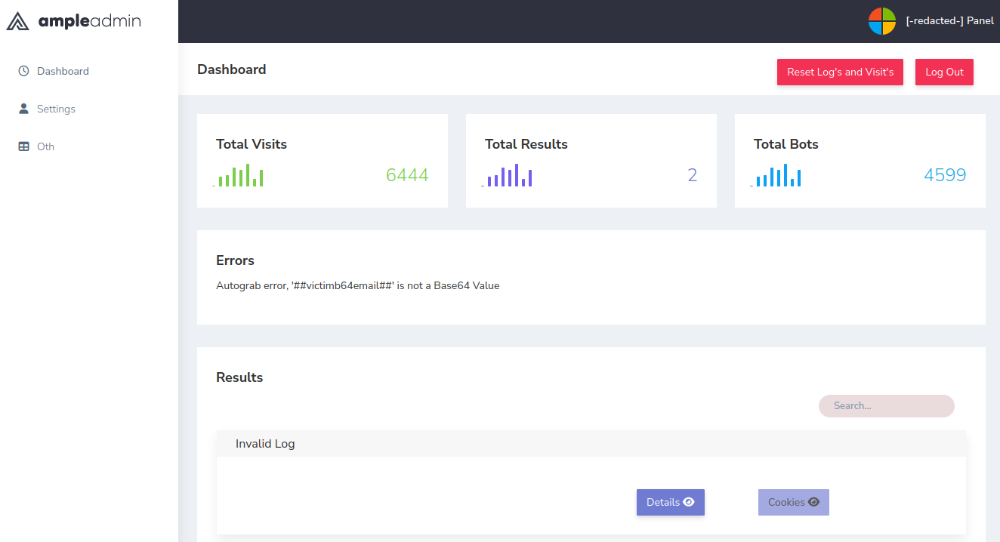

In the Results section likely would be the credentials.  At the time
of this writing decryption of the results had not been attained.
However, it can be implied that the following is shown.

- Username
- Password
- IP
- Type - Maybe this is MFA related

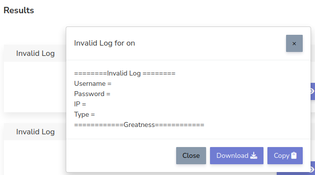

Below that is a complete list of visits, both bot and non-bot.

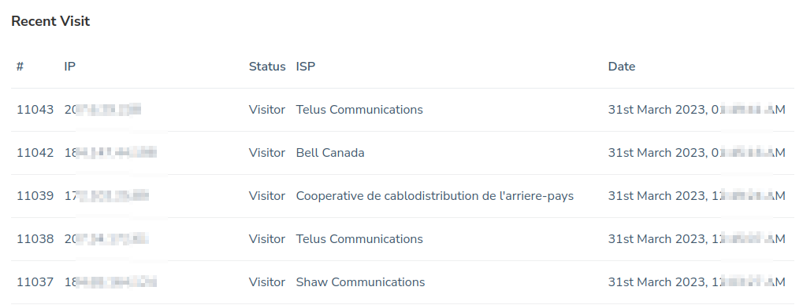

## Settings

On the settings page are the following fields that can be updated.
These are saved in `files/config.ini`.

- Name
- Password - SHA256 of password, but only 19 characters of it starting at position 2.  It appears to be used in encryption of the results.
- Email for Rst's - Appears to be for results aka credentials.  Disabled for now.
- FileName For Results
- Chat ID - Telegram chat id
- BOT Token - Telegram bot token
- API KEY - in the config.ini this comment is above the `api=` line

  `;Your api key here,you can get one from @fisherstell`

- Finish Url
- WhiteList Ip - SHA256 of IP, but only 19 characters of it starting at position 2.  Once set this becomes the only IP allowed to connect to the admin panel.
- Send Visit - send details about each visit to a Telegram bot.

  Using either `$_SERVER['HTTP_X_FORWARDED_FOR']` or `$_SERVER['REMOTE_ADDR']`
  details are gathered from NordVPN using this URL:
  `https://nordvpn.com/wp-admin/admin-ajax.php?action=get_user_info_data&ip=`  

  Details send to bot are the following.
  - `Victim : $ip1`
  - `City : $city`
  - `Country : $country`
  - `Browser : $browser`
  - `Device : $os`
  - `ISP : $isp`

- Block Bot - automatically add detected bots to htaccess deny


## Others

On the others page you can generate the phishing attachments.

### Generate HTML Attach

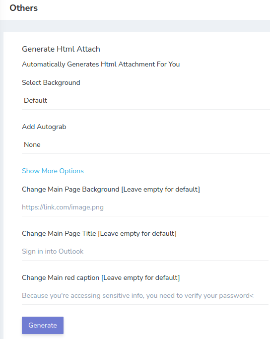

Options for the background are the following.

- Default
- Aging
- Word
- Office
- PDF
- Excel

When you enable Autograb you are given a notice about it.

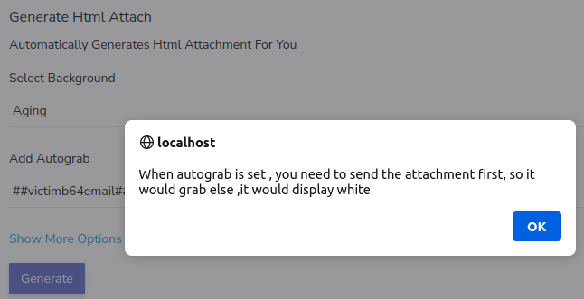

When you click `Generate` it makes a POST call to `admin/js/make.php`
with data `make=1`.  This will do two things.

1. Copy `j.php` to `{random}.php`.  For example `9fa6447.php`.
1. Present user with a obfuscated HTML that references the randomly named PHP.

```
https://example.com/host26/9fa6447.php
```


If downloaded, it is named `attachment.html`.

### Generate No background HTML Attach

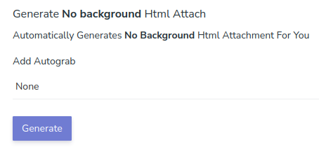

When this generate is clicked, it too calls the `admin/js/make.php`
with data `make=1` and creates a randomly named PHP.

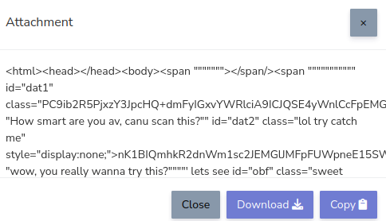

### Generate Link Based Page


When this generate is clicked, it calls the `admin/js/make.php`
but this time with data `make=2` and copies `j2.php` to a randomly named PHP.

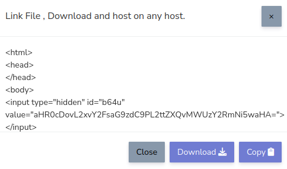


### Generate Type Fast Link Based Page


This calls `admin/js/make.php` with data `make=2`.

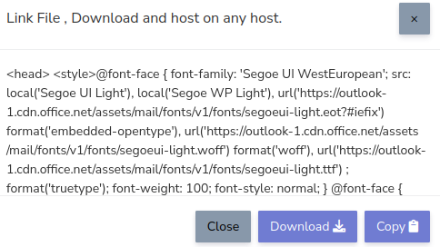

### Check Server Status


This does a POST to `j.php` with data `live=1`.

What this is doing is calling the `j.php` which in turn is
calling the API server.


You can manually check if the API server is up or down.
```bash
$ curl -X POST https://example.com/host16/j.php -d 'live=1'
1
```

- 0 means down
- 1 means up

### Block a Bot

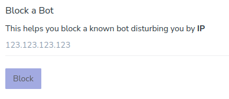

This updates `.htaccess` with a deny.

```
deny from 123.123.123.123
```

### Upload server file

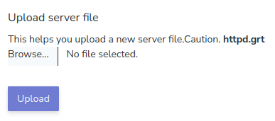

This file contains the obfuscated hostname for the API server.

```bash
$ cat httpd.grt                         
b7304a83ea=IMD8mOAG0kLLJ9Mus0zSrKSrYtTLhMyq2kStsS0xIDTJx8LXLttP9UTrwJe
```

From `j.php` is the code to decode this file.

```php
if(file_exists('./files/httpd.grt')){
    $temphost = file_get_contents('./files/httpd.grt');
    $temphost = strrev(str_replace('b7304a83ea','',$temphost));
    $temphost = gzuncompress(base64_decode($temphost));
    $temp_host = str_rot13($temphost);
}
```

What we see is that what appears to be a key = value is instead
junk followed by a reversed base64 string.

A simple short PHP script can be used to extract it.

```php
$ cat show-httpd.grt.php
<?php

$temphost = file_get_contents('./httpd.grt');
$temphost = strrev(str_replace('b7304a83ea','',$temphost));
$temphost = gzuncompress(base64_decode($temphost));
$temp_host = str_rot13($temphost);

echo($temp_host);
```

Run the script to do the extraction.

```bash
$ php show-httpd.grt.php
http://dyno44.herokuapp.com/api2.php
```

## Files and Directory Structure

```
.
├── admin
│   ├── js
│   │   ├── custom.js
│   │   ├── fr.js
│   │   ├── jqr.js
│   │   ├── make.php
│   │   └── mj.php
│   ├── 404.php
│   ├── blank.php
│   ├── error.log
│   ├── index.php
│   ├── log.json
│   ├── logs.json
│   └── profile.php
├── files
│   ├── config.ini
│   └── httpd.grt
├── .htaccess
├── {random}.php
├── {random}.php
├── j2.php
└── j.php
```

## Central API

The phishing kit uses a central API.  This appears something
that would be changed from time to time.  At the time of
this writing it was `http://dyno44.herokuapp.com/api2.php`.

Within `j2.php` is the function `do_it()` which performs the
API call.

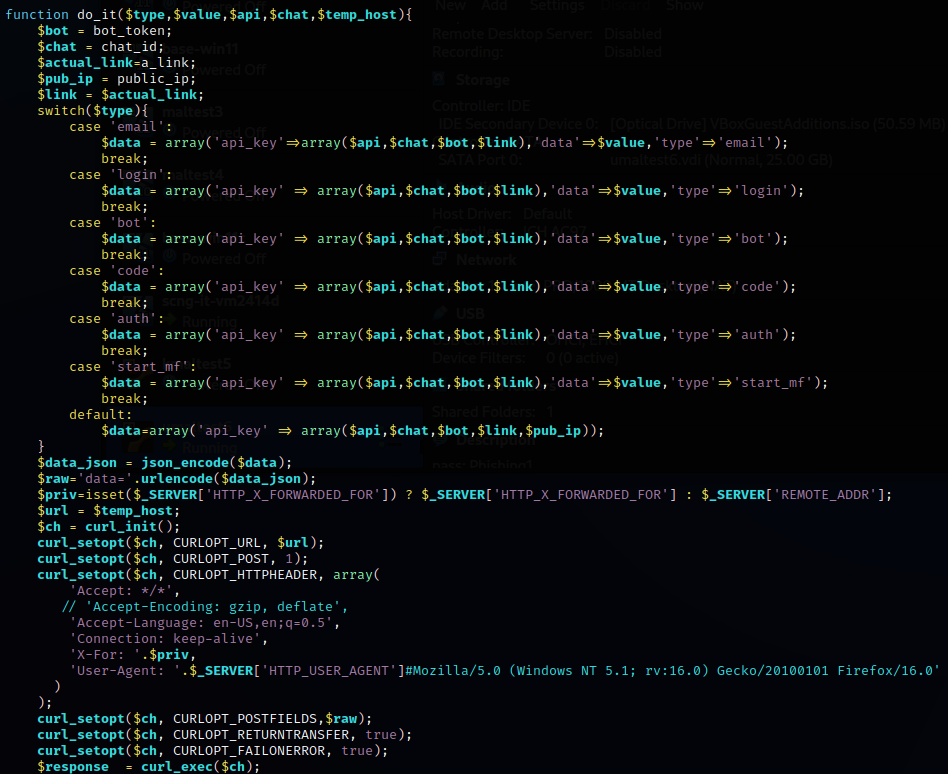

Both a valid api key and Chat ID are required.

### Type - default empty

Responses from API include the following.

- `no_api`
- `incorrect` - potentially incorrect Chat Id specified
- `valid` - api key and Chat Id are confirmed valid

### Type - email

This appears to lookup the company background and logo for
provided email.

- `{"bg_image":"","logo_image":""}`
- `incorrect` - potentially incorrect Chat Id specified


## J and J2 API

Both `j.php` and `j.php` offer an API of sorts.

### live - J

Only `j.php` offers the `live` call.  Based on results from the main API,
either `0` or `1` will be echoed.


With results from a recent urlscan.io query, you can test if
a URL is still live via TOR.

```bash
$ sudo systemctl start tor
$ url='https://gopromotions.mx/willis/j.php'
$ torsocks curl -s -X POST "$url" -d "live=1"
1
```

### scte - J

For `j.php`, the parameter `scte` is used to fetch the remaining HTML/JS.
It should be set to a base64 encoded email address.

Parameter `conf` is optional and can be set to a base64 JSON of the following.

- title
- back
- caption

It calls the central API with no `type` just to confirm API
is available.  If backend API responds with `valid`, than
base64 encoded HTML is returned.  Otherwise if API responded with
`ip_ban` return `ip_ban`.  Otherwise just return `no.

```bash
$ email=$(echo test@testing.com | base64)
$ echo $email
dGVzdEB0ZXN0aW5nLmNvbQo=
$ url="https://mainstreamalliance.com/host%5bv17%5d/j.php"
$ torsocks curl -s -X POST "$url" -d "scte=$email" | head -c 100
PGh0bWwgZGlyPSJsdHIiIGxhbmc9ImVuIj4NCiAgIDxtZXRh...
```

### scte - J2

The parameter `scte` can be set to anything.

First this performs a backend API call merely to confirm that
the backend is responding.  Next it uses NordVPN to get details
about the source IP.  If it decides the source is a bot,
then it is blocked.  Finally it sends the phishing page HTML.

```bash
$ url='https://m1cr0s0fty0nline.com/host/j2.php'

$ torsocks curl -s -X POST $url -d "scte=1" | head -c 100
<html dir="ltr" lang="en"><head><meta charset="utf-8">
   <link href="data:image/x-icon;base64,AAAB..."
```

### em

The parameter `em` must be set to a email address. The email
is validated for format.

This uses the backend API to look for any appropriate background
and logo based on the email address.

```bash
$ torsocks curl -s -X POST $url -d "em=testingemail@outlook.com"
{"bg_image":"","logo_image":""}
```

### auth

There's two methods to use `auth`.

The first is to set `auth` to `1` and then set `st` to the email address.
This appears to be an older method that merely returns whatever the API returns.


The other is to set `auth` to a email address.  This method
also takes a `pswd` parameter for password.  Those are sent to the API with `login`.
`auth` will check the API response for these.

- `valid`
- `sms`
- `mfa1`
- `mfa2`

If no match, then it echos a JSON with `fail`.

For the 2FA responses, besides echoing a JSON with the type, it
also contains a `file` which came from the API.  This would seem
to be some state information related to the 2FA flow.


### start_mfa

### mf_code

### code

Used with SMS flow.

### admin

This one is actually a GET parameter.

This will send a Telegram mesage with basic stats.

### lef - J

Sends a Telegram that the Victim left the page.

### random - J

Returns JSON with 22,716 array entries.


## Bot Blocking

If `config.ini` has `block_bot` equal to `1` then it will use
the results from a NordVPN webcall to help decide if the originator
is something it does not like.

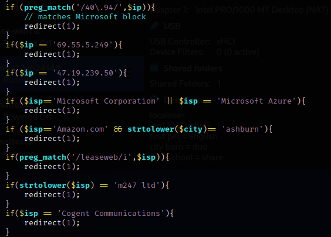
